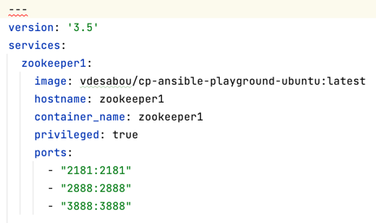

# Base Docker Image

Create a basic, Ubuntu based docker image that can be used to create containers where Confluent (or other) components can be deployed into, removing the need to create expensive VMs through public cloud providers.

## Prerequisites

    GIT
    Docker & Docker Compose

## Image Creation Steps

Clone Repository

    git clone https://github.com/lbeqiric/iac.git

Change Directory

    cd ../docker

Build Docker Image & Push (optional)

    docker build -t lbeqiriconfluent/base-image-ubuntu:latest .
    docker push lbeqiriconfluent/base-image-ubuntu:latest

Edit docker-compose-confluent.yml file, provide additional config if required

    vi docker-compose-confluent.yml

Start the containers 

    docker-compose -f docker-compose-confluent.yml up -d